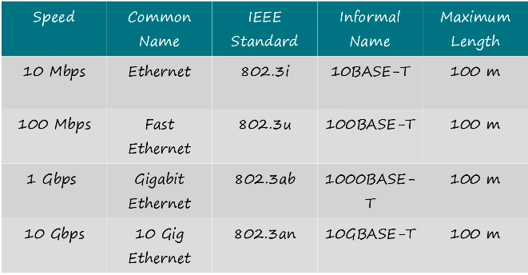
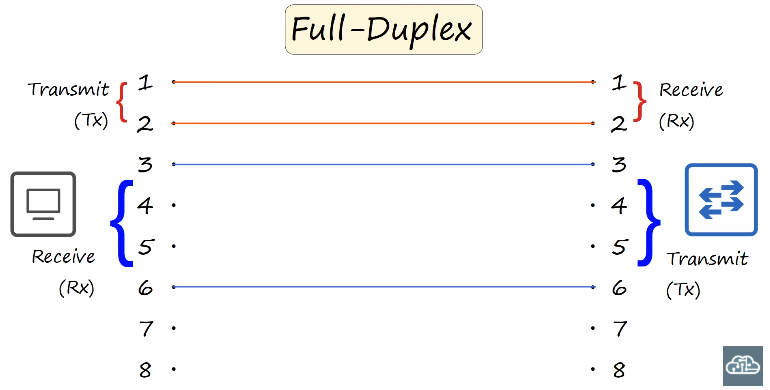
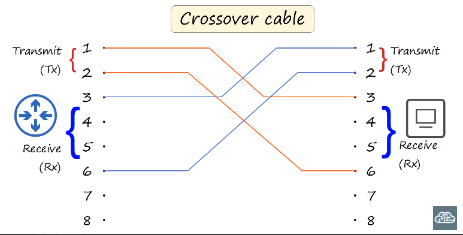
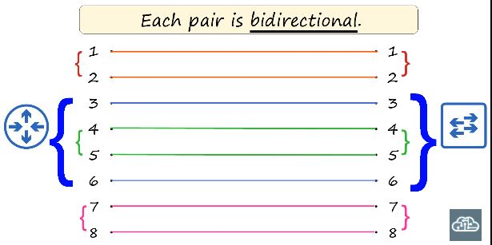
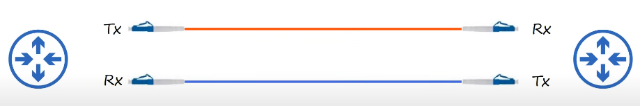
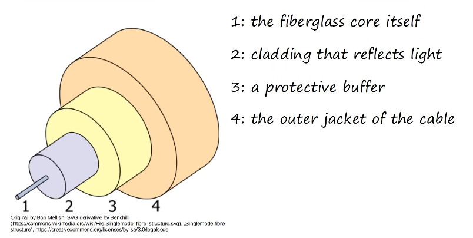
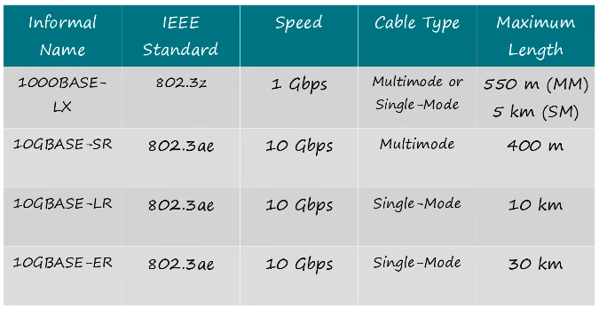
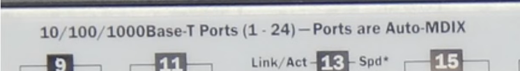

# Day 2 – Interfaces & Cables

### RJ-45

* Registered Jack 45
    * Found on the end of ethernet cables

### Ethernet

* A collection of network protocols/standards

### Network Protocols

* A standardization that allows devices to function and communicate between different manufacturers devices

### Bits and Bytes

* Computers use **binary** (0's and 1's)

* A **byte** is a series of 8 **bits**

* Common measurements (in bits)

    * **kilobit** (kb): 1,000 (thousand)
    * **megabit** (mb): 1,000,000 (million)
    * **gigabit** (gb): 1,000,000,000 (billion)
    * **terabit** (tb): 1,000,000,000,000 (trillion)

### Ethernet Standards

* Created in 1983, defined by the IEEE in **802.3**
    * IEEE: Institute of Electrical and Electronics Engineers

* Copper ethernet cable standards
    * Used in **UTP Cables**
    * 
    * Informal Names
        * Number refers to the speed
            * 10: Ethernet (10Mbps)
            * 100: Fast Ethernet (100 Mbps)
            * 1000: Gigabit Ethernet (1000 Mbps)
            * 10G: 10 Gig Ethernet (10 Gbps)
        * BASE means baseband signaling
        * T means twisted pair cabling
    * Notice all have **max length of 100m**

### UTP Cables

* Unshielded Twisted Pair
    * Unshielded: no metallic shield
        * Vulnerable to EMI
    * Twisted Pair
        * Helps prevent EMI
        * There are 4 pairs of twisted wires
            * 8 wires total, not all may be used depending on standard
                * 2 pairs (4 wires)
                    * **10BASE-T**
                    * **100BASE-T**
                * 4 pairs (8 wires)
                    * **1000BAST-T**
                    * **10GBASE-T**
        
### UTP Cable wiring variations

* **10BASE-T** & **100BASE-T** UTP Cables
    * Different devices transmit (Tx) and receive (Rx) data on different pins
        * **Router**, **Firewall**, **PC**
            * TX: 1 and 2
            * RX 3 and 6
        * **Switch**
            * Tx: 3 and 6
            * Rx 1 and 2
        * This allows for **full-duplex** transmission
            * **Full-Duplex**: Data can be TX and Rx simultaniously without collisions due to different wire pairs
    * **Straight-through cables**
        * Connect pins from one RJ45 connector to the same pins on the other RJ45 connector
            * 1-1, 2-2, 3-3, 6-6
                * 
        * **Can** be used to connect
            * PC/Firewall/Router <-> Switch <-> PC/Firewall/Router
        * **Cannot** be used to connect (assuming no **auto mdi-x**)
            * PC/Router/Firewall <-> PC/Router/Firewall
            * Switch <-> Switch
    * **Crossover cables**
        * Connect pins from one RJ45 connector to the opposite Tx/Rx pins on the other RJ45 connector
            * 1-3, 2-6, 3-1, 6-2
                * 
                * These are the pins used, others are still connected, but unused
                    * The others are 4-7, 5-8, 7-4, 8-5

* **1000BASE-T** & **10GBASE-T** cables
    * Use all **4 pairs** (8 wires)
        * Each pair is **bidirectional**
            * Not dedicated to Tx or Rx data like **10BASE-T** & **100BASE-T**
            * Part of the reason they can operate at faster speeds
        * 

### Auto MDI-X

* Modern devices use **Auto MDI-X**
    * Auto-negotiates which pins to use to ensure communication between devices regardless of if straight-through or crossover cables are used

### Fiber-Optic Connections

* **SFP Transceiver**
    * SFP: Small Form-Factor Pluggable
    * Plugs in to network devices to connect fiber-optic cables

### Fiber-optic Cables
* Use light over glass fibers to transmit data
* Contains 2 glass fibers
    * 
* Has 4 layers
    * Fiberglass core
    * Cladding to reflect light through the core
    * Protective buffer
    * Outer jacket
    * 

* **Multi-mode Fiber**
    * **Wider** core diameter
    * **Multiple angles** (modes) of light can enter the fiberglass core
    * Cables can be **longer than UTP** but **shorter than single-mode** fiber
    * **Cheaper** than single-mode fiber
        * Uses cheaper LED-based SFP transmitters
* **Single-mode Fiber**
    * **Narrower** core diameter
    * **Single angle** of light can enter the fiberglass core
    * Cables can be **longer than UTP** & **longer than multi-mode** fiber
    * **More expensive** than multi-mode fiber
        * Uses more expensive laser-based SFP transmitters

### Fiber-optic Cable Standards

### UTP vs Fiber-optic Cabling

UTP

* Lower cost than fiber-optic
* Shorter maximum distance than fiber-optic (~100m)
* Can be vulnerable to EMI
* RJ45 ports are cheaper than SFP ports
* Emit a faint signal outside of the cable
    * May be copied = security risk

Fiber-optic

* More expensive than UTP
* Longer maximum distance than UTP
* No EMI vulnerability
* SFP ports are more expensive then RJ45 ports
    * Single-mode is more expensive than multi-mode
* DOes not emit signals outside of the cable
    * Can't be copied = no security risk

## Quiz Questions

1. You connect two old routers together with a UTP cable, however data is not successfully sent and received between them. What could be the problem?

        A. They are connected with a straight-through cable*
        B. They are connected with a crossover cable
        C. They are operating in MDI-X mode

    * Older devices may not have **auto mdi-x** and require the proper cable
    * Routers Tx and Rx on the same pins, so they won't be able to communicate without a crossover cable or **auto mdi-x**

2. Your company wants to connect switches in two seperate buildings that are about 150 meters apart. They want to keep costs down, if possible. What kind of cable should they use?

        A. UTP
        B. Single-mode fiber
        C. Multi-mode fiber*
    
    * UTP is not supported over 100m
    * Single-mode fiber is more expensive than multi-mode
    * Multimode will work at 150m and is less expensive than single-mode fiber

3. Your company wants to connect two different offices that are about 3 km apart. They want to keep costs down if possible. Which kind of cable should they use?

        A. UTP
        B. Single-mode fiber*
        C. Multi-mode fiber

    * UTP is not supported over 100m
    * Single-mode fiber is the most expensive, but is supported up to 30km
    * Multimode is not supported over 550m

4. A switch has the following indication over its network interfaces.

    

    What would happen if you connect it to an identical switch with a straight through cable?

        A. They would operate normally*
        B. They would operate at a reduced speed
        C. They would be unable to communicate

    * The ports are **auto mdi-x** enabled
        * A straight through cable will be auto-negotiated and work normally

5. Your cmpany needs to connect many end hosts to a switch which is in a wiring cabinet on the same office floor as the hosts. What kind of cable should they use?

        A. UTP*
        B. Single-mode fiber
        C. Multi-mode fiber
    * The runs in the office are probably shorter than 100m, UTP is cheaper and  not as delicate as fiber
    * Switches typically have many RJ45 ports for UTP cables    